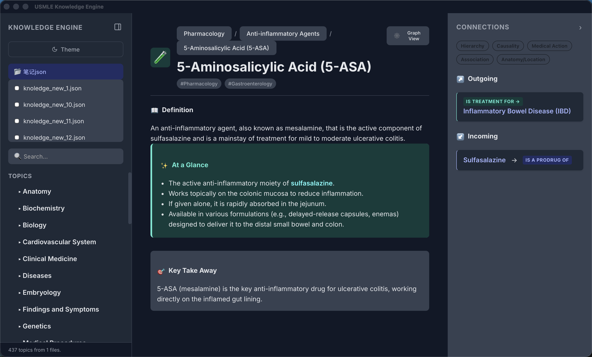

# USMLE Knowledge Engine v10


一款为 USMLE 学习者设计的高性能、本地优先的知识图谱浏览器。本项目利用现代 Web 技术栈构建，并通过 Tauri 框架打包为跨平台的桌面应用程序，旨在提供一个快速、可定制且离线的知识探索体验。




---

## ✨ 核心功能

*   **动态数据加载**: 通过本地文件系统 API (`window.showDirectoryPicker`)，用户可以安全地加载和管理本地的知识库 JSON 文件，所有数据均在本地处理，无需上传。
*   **三栏响应式布局**: 采用由 `useResizablePanels` 驱动的可调整大小的三栏布局（导航、主内容、连接），在桌面端提供强大的信息密度，同时在移动端自动适配为抽屉式导航。
*   **层级与分类导航**: 知识点根据 `classificationPath` 自动构建为可折叠的树状导航，便于用户按学科和系统进行探索。
*   **强大的模糊搜索**: 集成 `Fuse.js`，对知识点标题、标签、别名和内容提供毫秒级的模糊搜索能力，并按相关性排序。
*   **交互式知识图谱**: 通过 `@xyflow/react` 和 `elkjs` 自动布局算法，一键生成以当前知识点为中心的可视化关系图，直观展示知识点之间的语义连接。
*   **丰富的语义连接**: 智能解析 `connections` 数组，展示当前知识点的上游（传入连接）和下游（传出连接）关系，并根据关系类型（如 `is_a_type_of`, `causes`）进行颜色编码。
*   **内容悬浮预览**: 鼠标悬停在文中的内部链接 `[[...]]` 上时，会显示一个简洁的浮动窗口，预览该知识点的核心定义，避免频繁跳转。
*   **Markdown 与富文本渲染**: `atAGlance` 和 `takeAway` 等内容字段支持 Markdown 语法，并通过 `DOMPurify` 进行安全渲染，实现丰富的文本格式。

## 🛠️ 技术栈

*   **前端框架**: React 18 + TypeScript
*   **构建工具**: Vite
*   **桌面端框架**: Tauri (使用 Rust 后端)
*   **状态管理**: Zustand
*   **图表可视化**: @xyflow/react (React Flow)
*   **图表自动布局**: elkjs
*   **模糊搜索**: Fuse.js
*   **数据处理脚本**: Python (位于 `/scripts` 目录)
*   **代码规范**: ESLint + Prettier

## 📂 项目结构

项目根目录包含前端应用和 Python 脚本，结构清晰，职责分明。

```
.
├── 📄 README.md                # 本文件
├── 📂 data/                     # 存放原始或处理后的知识库 JSON 文件
│   └── knowledge_base_complete.json
├── 📂 knowledge-engine-react/   # React 前端应用的根目录 (Git 子目录)
│   ├── 📂 public/               # Vite 公共资源
│   ├── 📂 src/                  # React 应用源代码
│   │   ├── 📂 components/       # UI 组件
│   │   ├── 📂 hooks/            # 自定义 React Hooks
│   │   ├── 📂 utils/            # 通用工具函数 (布局、数据处理)
│   │   ├── App.tsx              # 应用主组件
│   │   └── main.tsx             # 应用入口
│   ├── 📂 src-tauri/            # Tauri 后端 (Rust) 代码
│   │   ├── Cargo.toml           # Rust 依赖管理
│   │   └── src/                 # Rust 源代码
│   ├── package.json             # Node.js 依赖和脚本
│   └── vite.config.ts         # Vite 配置文件
└── 📂 scripts/                  # 数据处理脚本
    └── process_data.py          # 用于处理和生成知识库 JSON 的 Python 脚本
```

## 🚀 快速开始

### 先决条件

1.  **Node.js**: 请确保已安装 `v18.0.0` 或更高版本。
2.  **Rust & Tauri**: 本项目使用 Tauri 打包为桌面应用。请遵循 **[Tauri 官方指南](https://tauri.app/v1/guides/getting-started/prerequisites)** 完成您操作系统的环境配置。这通常包括安装 Rust (cargo)、WebView2 (Windows) 和其他必要的构建工具。

### 安装与运行

1.  **克隆仓库**
    ```bash
    git clone <your-repository-url>
    cd <your-repository-directory>
    ```

2.  **进入前端项目目录**
    ```bash
    cd knowledge-engine-react
    ```

3.  **安装依赖**
    ```bash
    npm install
    ```

4.  **运行开发服务器**
    这将以桌面应用模式启动一个带有热重载的开发窗口。
    ```bash
    npm run tauri dev
    ```

### 构建生产版本

要构建一个独立的、可分发的桌面应用程序：

1.  确保您位于 `knowledge-engine-react` 目录下。
2.  运行构建命令：
    ```bash
    npm run tauri build
    ```
3.  构建完成后，安装包将位于 `knowledge-engine-react/src-tauri/target/release/bundle/` 目录下。

## 💾 知识库数据结构

本应用的核心是结构化的 JSON 文件。每个知识点（Topic）都遵循以下基本结构：

```json
{
  "topic_id": { // 唯一的标识符
    "title": "Topic Title", // 知识点标题
    "primaryType": "disease", // 主类型 (如: disease, structure, process, substance)
    "tags": ["Tag1", "Tag2"], // 相关标签
    "classificationPath": ["Category", "Subcategory"], // 用于导航树的层级路径
    "content": {
      "definition": "...", // 核心定义
      "atAGlance": "<ul><li>Point 1</li><li>Point 2</li></ul>", // 要点速览 (支持 HTML/Markdown)
      "takeAway": "..." // 关键总结
    },
    "connections": [ // 知识点之间的语义连接
      {
        "type": "is_a_type_of", // 连接类型
        "to": "another_topic_id" // 目标知识点ID
      }
    ]
  }
}
```

您可以在 `/data` 目录下查看 `knowledge_base_complete.json` 作为完整示例。`/scripts/process_data.py` 脚本用于处理原始数据并生成这种格式。

## 💡 未来展望与贡献

*   **性能优化**: 针对超大规模知识库（>5000个节点）的图表渲染性能优化。
*   **新增数据源**: 编写新的 Python 脚本以适配和导入其他来源的知识库。
*   **高级筛选**: 在连接面板中加入更复杂的筛选和排序逻辑。
*   **云同步**: （可选）增加与云端存储同步知识库的功能。

欢迎提交 Pull Requests 或开启 Issues 来讨论新功能和改进点！

## 📄 许可证

本项目采用 [MIT 许可证](LICENSE)。